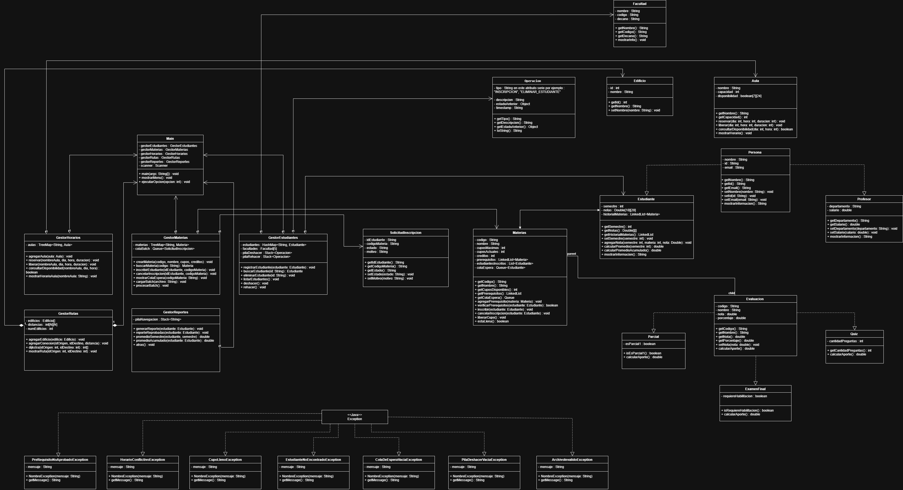

# Sistema de Gestión Académica y Planificación de Rutas de Aprendizaje

## 1. Descripción del Proyecto

Este proyecto consiste en el desarrollo de un sistema de gestión académica orientado a la administración de estudiantes, materias, horarios, pre-requisitos y desplazamientos dentro de un entorno universitario.

El sistema permite modelar la estructura organizacional de una institución educativa y gestionar procesos académicos fundamentales. Adicionalmente, incorpora un mecanismo de control de operaciones que permite deshacer y rehacer acciones realizadas por el usuario.

Este proyecto se desarrolla como trabajo final del curso de Estructuras de Datos, con el objetivo de aplicar los conceptos estudiados en un contexto práctico.

---

## 2. Objetivos

### 2.1 Objetivo General

Desarrollar un sistema de gestión académica que integre múltiples estructuras de datos para el manejo eficiente de la información universitaria.

### 2.2 Objetivos Específicos

* Administrar información de estudiantes y profesores.
* Gestionar materias, evaluaciones y pre-requisitos.
* Organizar horarios y asignación de aulas.
* Simular rutas de desplazamiento dentro del campus.
* Implementar un sistema de deshacer y rehacer operaciones.
* Aplicar estructuras de datos vistas en el curso.

---

## 3. Estructuras de Datos Utilizadas

El sistema hace uso de las siguientes estructuras:

* Matrices (arreglos bidimensionales): utilizadas para la gestión de horarios y distribución de aulas.
* Arreglos estáticos: empleados para almacenamiento de datos de tamaño fijo.
* Listas enlazadas: utilizadas para la gestión dinámica de colecciones de objetos.
* Pilas (Stack): implementadas en el sistema de deshacer operaciones.
* Colas (Queue): empleadas para la gestión de procesos en orden de llegada.
* Mapas (HashMap / TreeMap): utilizados para el acceso eficiente a los datos mediante claves.

---

## 4. Arquitectura del Sistema

El sistema está diseñado bajo el paradigma de programación orientada a objetos. Las principales entidades identificadas en el modelo son:

* Persona (clase base)

  * Estudiante
  * Profesor
* Materia
* Evaluación

  * Parcial
  * Quiz
  * Examen Final
* Aula
* Edificio
* Facultad

Adicionalmente, se definen componentes encargados de la lógica del sistema:

* GestorEstudiantes
* GestorMaterias
* GestorHorarios
* GestorRutas
* GestorReportes

El sistema también incluye un módulo de operaciones que permite registrar acciones y gestionar su deshacer/rehacer mediante estructuras tipo pila.

---

## 5. Diagrama UML

El siguiente diagrama representa la estructura del sistema y las relaciones entre sus componentes:

---

## 6. Ejecución del Proyecto

1. Clonar el repositorio:
   git clone https://github.com/santirios66/sistema-gestion-academica.git

2. Abrir el proyecto en un entorno de desarrollo compatible con Java (IntelliJ IDEA, NetBeans o Visual Studio Code).

3. Ejecutar la clase principal del sistema (Main.java).

---

## 7. Decisiones de Implementación

Para el desarrollo del sistema se optó por utilizar las estructuras de datos proporcionadas por la biblioteca estándar de Java (Collections Framework), tales como LinkedList, Stack, Queue y HashMap.

Esta decisión permite:

* Reducir la complejidad de implementación.
* Garantizar eficiencia en las operaciones.
* Enfocar el desarrollo en la lógica del sistema.

---

## 8. Autor

Santiago Patiño Ríos
Programa de Ingeniería de Sistemas
Universidad Cooperativa de Colombia

---

## 9. Información Académica

Curso: Estructuras de Datos
Docente: Ing. Jhon Haide Cano Beltrán MSc.
Fecha: 6 de mayo de 2026

---

## 10. Estado del Proyecto

En desarrollo
